# Law_LLM 法律AI助手项目技术报告

## 1. 项目概述

### 1.1 项目背景
Law_LLM是一个基于大语言模型的智能法律问答系统，旨在为用户提供专业的法律咨询服务和法律文书生成功能。该项目作为生产实习项目，结合了检索增强生成(RAG)技术、多Agent架构和现代Web开发技术。

### 1.2 核心价值
- **智能问答**：提供7×24小时在线法律咨询服务
- **文书生成**：自动生成各类法律合同和文书
- **知识检索**：快速检索相关法律条文和案例
- **用户友好**：直观的Web界面和流畅的交互体验

## 2. 技术架构

### 2.1 总体架构

#### 系统分层架构图
```
┌─────────────────┐    ┌─────────────────┐    ┌─────────────────┐
│   前端界面层    │    │   API网关层     │    │   数据存储层    │
│                 │    │                 │    │                 │
│ • Vue 3前端     │◄───┤ • FastAPI后端   │◄───┤ • MySQL数据库   │
│ • Element Plus  │    │ • RESTful API   │    │ • FAISS向量库   │
│ • 响应式设计    │    │ • 用户认证      │    │ • 法条JSON数据  │
│ • 路由管理      │    │ • 会话管理      │    │ • 文件存储      │
└─────────────────┘    └─────────────────┘    └─────────────────┘
                              │
                              ▼
                       ┌─────────────────┐
                       │   业务逻辑层    │
                       │                 │
                       │ • AgentDispatcher│
                       │ • LawAgent      │
                       │ • ContractAgent │
                       │ • FAQAgent      │
                       └─────────────────┘
                              │
                              ▼
                       ┌─────────────────┐
                       │   AI服务层      │
                       │                 │
                       │ • DeepSeek LLM  │
                       │ • RAG检索系统   │
                       │ • 向量编码模型  │
                       │ • FAISS索引     │
                       └─────────────────┘
```

#### 完整系统流程图
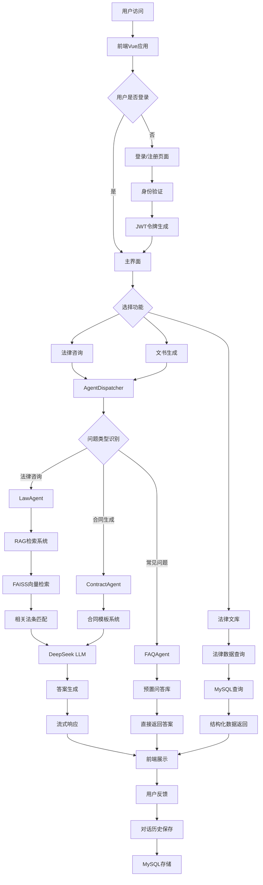

### 2.2 技术选型说明

#### 前端技术栈
- **Vue 3 (Composition API)**: 现代化的前端框架，提供响应式数据绑定和组件化开发
- **Element Plus**: 基于Vue 3的企业级UI组件库
- **Vite**: 快速的前端构建工具
- **Pinia**: 轻量级状态管理库
- **Vue Router 4**: 客户端路由管理
- **SCSS**: CSS预处理器，提供更强大的样式编写能力
- **Axios**: HTTP客户端库，用于API调用

#### 后端技术栈
- **FastAPI**: 高性能异步Web框架，自动生成OpenAPI文档
- **Uvicorn**: 高性能ASGI服务器
- **PyMySQL**: MySQL数据库连接器
- **Pydantic**: 数据验证和序列化库
- **python-jose**: JWT令牌处理
- **passlib**: 密码加密库

#### AI与检索技术
- **DeepSeek API**: 大语言模型服务
- **FAISS**: Facebook开源的高效向量检索库
- **Sentence Transformers**: 多语言文本嵌入模型
- **paraphrase-multilingual-MiniLM-L12-v2**: 轻量级多语言文本编码模型

#### 数据存储
- **MySQL**: 关系型数据库，存储用户信息、对话历史等结构化数据
- **JSON文件**: 存储法律条文等半结构化数据
- **FAISS索引**: 存储文本向量和元数据

## 3. 系统功能模块

### 3.1 用户认证系统
- **用户注册**: 支持用户名、邮箱、密码注册
- **用户登录**: JWT令牌认证机制
- **权限管理**: 基于令牌的API访问控制
- **会话管理**: 自动刷新和过期处理

### 3.2 AI问答系统
- **智能路由**: AgentDispatcher根据问题类型分发到相应Agent
- **法律咨询**: LawAgent处理一般法律问题
- **合同生成**: ContractAgent生成各类法律文书
- **常见问题**: FAQAgent快速响应高频问题
- **上下文记忆**: 支持多轮对话和上下文理解

### 3.3 RAG检索系统
- **语义检索**: 基于向量相似度的智能检索
- **法条匹配**: 精确匹配相关法律条文
- **结果排序**: 基于相似度和相关性排序
- **上下文增强**: 结合检索结果生成更准确的回答

### 3.4 文书生成功能
- **合同模板**: 租赁、买卖、劳动、借款、服务合同
- **智能定制**: 根据用户需求个性化生成合同内容
- **格式规范**: 符合法律文书格式要求
- **修改功能**: 支持对生成的合同进行修改和完善

### 3.5 法律文库管理
- **文档上传**: 支持JSON格式的法律文档上传
- **分类管理**: 按法律类别组织文档
- **全文检索**: 支持关键词搜索和语义搜索
- **结构化展示**: 按章节、条文等结构化展示法律内容

## 4. 数据处理流程

### 4.1 数据爬取与清洗

#### 数据处理完整流程图
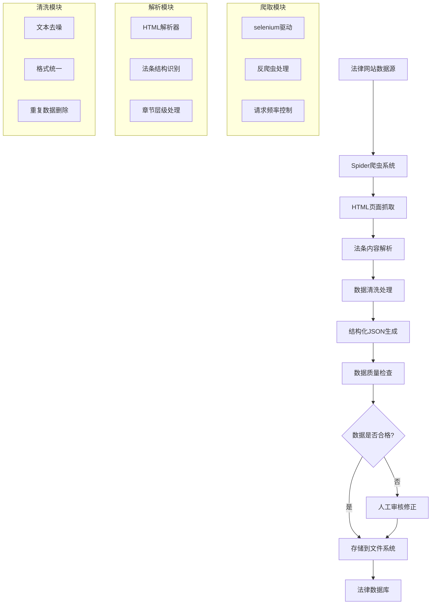

#### 数据爬取技术栈
```python
# 主要爬取工具和流程
spider.py → 使用Selenium WebDriver爬取法律网站
law_parser.py → 解析HTML内容，提取法条结构
clean_laws.py → 数据清洗和格式标准化
utils.py → 工具函数：文本处理、文件操作等
```

#### 爬取范围和数据规模
- **覆盖法律**: 40+部重要法律法规
- **主要包含**: 民法典、刑法、劳动法、公司法、行政法等
- **数据总量**: 3000+法律条文
- **数据格式**: 结构化JSON格式存储
- **更新频率**: 根据法律修订情况定期更新

#### 数据结构
```json
{
  "title": "法律名称",
  "parts": [
    {
      "part_title": "编名称",
      "chapters": [
        {
          "chapter_title": "章名称",
          "articles": [
            {
              "article_no": "条文编号",
              "article_content": "条文内容"
            }
          ]
        }
      ]
    }
  ]
}
```

### 4.2 向量化索引构建

#### FAISS索引构建流程图
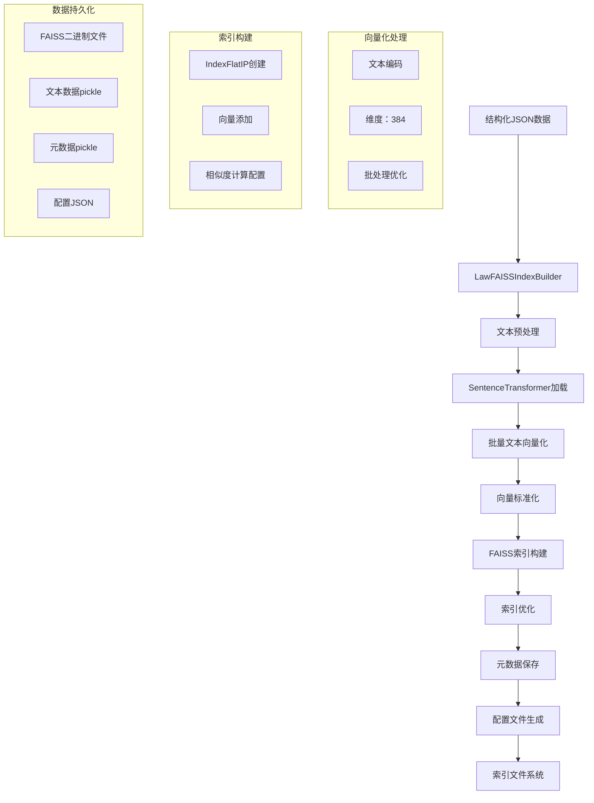

#### 向量化技术细节
```python
# FAISS索引构建完整流程
class LawFAISSIndexBuilder:
    def __init__(self, model_name: str = 'paraphrase-multilingual-MiniLM-L12-v2'):
        """初始化向量化模型"""
        self.model = SentenceTransformer(model_name)
    
    def build_index_from_json_dir(self, json_dir: str, save_dir: str):
        """从JSON目录构建完整索引"""
        all_texts = []
        all_metadata = []
        
        # 1. 加载所有JSON文件
        for filename in os.listdir(json_dir):
            if filename.endswith('.json'):
                file_path = os.path.join(json_dir, filename)
                data = self.load_json_data(file_path)
                all_texts.extend([item['text'] for item in data])
                all_metadata.extend(data)
        
        # 2. 批量向量化
        embeddings = self.build_embeddings(all_texts)
        
        # 3. 构建FAISS索引
        index = self.build_faiss_index(embeddings)
        
        # 4. 保存索引和数据
        self.save_index(index, all_texts, all_metadata, save_dir)
    
    def build_embeddings(self, texts: List[str]) -> np.ndarray:
        """构建文本嵌入向量"""
        print("正在构建文本嵌入向量...")
        embeddings = self.model.encode(
            texts, 
            show_progress_bar=True,
            batch_size=32,  # 批处理优化
            convert_to_numpy=True
        )
        return embeddings
    
    def build_faiss_index(self, embeddings: np.ndarray) -> faiss.IndexFlatIP:
        """构建FAISS索引"""
        print("正在构建FAISS索引...")
        
        # L2标准化（用于余弦相似度）
        faiss.normalize_L2(embeddings)
        
        # 创建内积索引
        dimension = embeddings.shape[1]
        index = faiss.IndexFlatIP(dimension)
        
        # 添加向量到索引
        index.add(embeddings.astype(np.float32))
        
        print(f"FAISS索引构建完成，包含 {index.ntotal} 个向量")
        return index
```

#### 技术参数详情
- **向量模型**: paraphrase-multilingual-MiniLM-L12-v2
- **向量维度**: 384维
- **索引类型**: IndexFlatIP（内积索引，用于余弦相似度）
- **相似度计算**: 余弦相似度（通过L2标准化实现）
- **检索性能**: <100ms平均响应时间
- **内存占用**: 约500MB（包含3000+向量）
- **存储格式**: 
  - `law_faiss_index.bin`: FAISS二进制索引文件
  - `law_texts.pkl`: 原始文本数据
  - `law_metadata.pkl`: 法条元数据
  - `index_config.json`: 索引配置信息

### 4.3 检索增强生成流程

#### RAG检索流程图


#### 详细问答处理流程
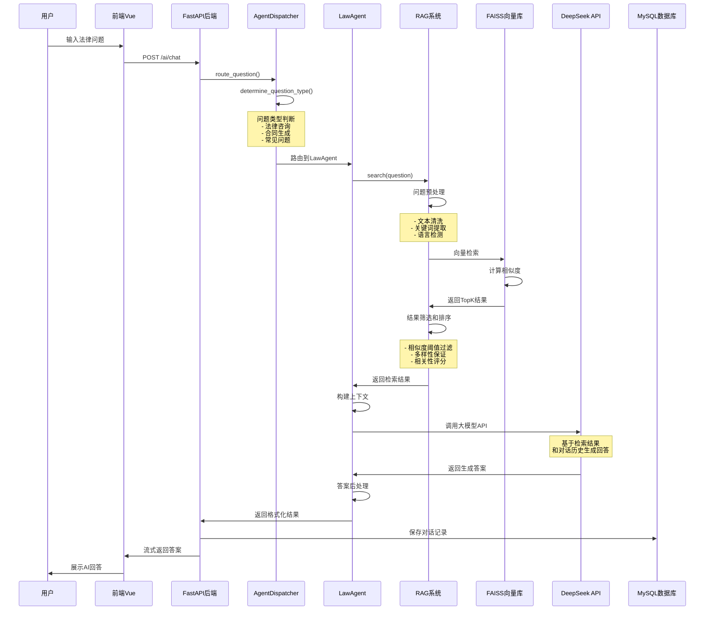

#### 技术实现细节
```python
# 完整的RAG检索流程实现
def process_legal_question(question: str) -> dict:
    # 1. 问题预处理
    processed_question = preprocess_question(question)
    
    # 2. 向量化编码
    question_vector = encode_text(processed_question)
    
    # 3. FAISS检索
    search_results = faiss_search(question_vector, top_k=10)
    
    # 4. 结果筛选
    filtered_results = filter_by_similarity(search_results, threshold=0.6)
    
    # 5. 上下文构建
    context = build_context(filtered_results, max_tokens=2000)
    
    # 6. LLM生成
    answer = call_llm_api(question, context)
    
    # 7. 后处理
    final_answer = post_process_answer(answer)
    
    return {
        "answer": final_answer,
        "references": filtered_results,
        "confidence": calculate_confidence(filtered_results)
    }
```

## 5. Agent架构设计

### 5.1 Agent协作流程图

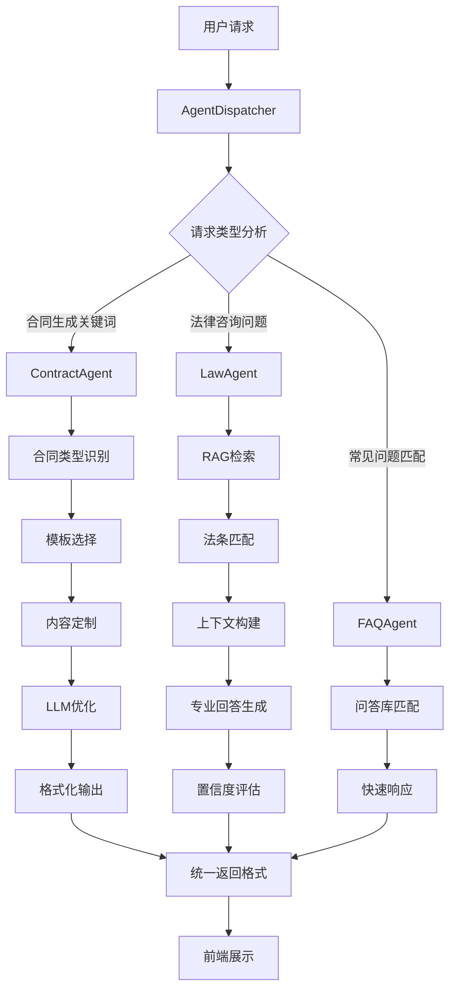

### 5.2 AgentDispatcher（智能调度器）

#### 问题类型识别流程
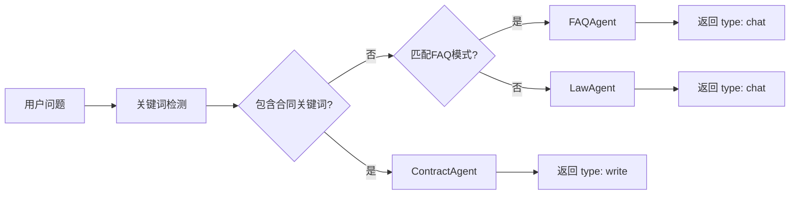

**职责**: 根据用户问题类型智能路由到相应的Agent
```python
def determine_question_type(self, question: str) -> str:
    # 合同生成关键词检测
    contract_keywords = ["制作", "起草", "拟定", "生成", "撰写", "编写"]
    contract_types = ["租赁合同", "买卖合同", "借款合同", "劳动合同", "服务合同"]
    
    # 检查合同生成请求
    if any(kw in question for kw in contract_keywords):
        return "write"
    
    if any(ct in question for ct in contract_types):
        if any(kw in question for kw in ["生成", "制作", "起草"]):
            return "write"
    
    # 默认为法律咨询
    return "chat"

def route_question(self, question: str, history_id: int, model: str, 
                  context_chats: list = None, history_type: str = None) -> dict:
    try:
        # 问题类型判断
        question_type = self.determine_question_type(question)
        
        # 路由到相应Agent
        if question_type == "write":
            if self.contract_agent:
                result = self.contract_agent.answer(question, context_chats=context_chats)
                result["type"] = "write"
                return result
        else:
            if self.law_agent:
                result = self.law_agent.answer(question, model=model, 
                                             context_chats=context_chats)
                result["type"] = "chat"
                return result
                
    except Exception as e:
        logger.error(f"Agent路由失败: {e}")
        return {"error": "系统繁忙，请稍后重试"}
```

**路由规则**:
- 合同生成请求 → ContractAgent
- 法律咨询问题 → LawAgent  
- 常见问题 → FAQAgent

### 5.3 LawAgent（法律问答专家）

#### LawAgent处理流程图
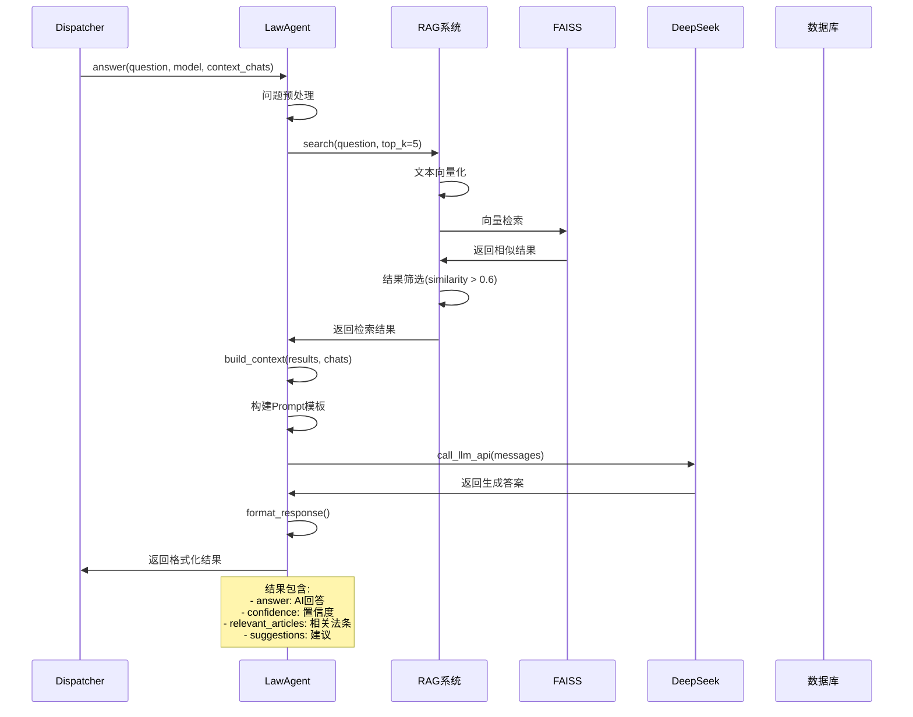

**核心功能**:
- RAG检索相关法条
- 结合上下文生成专业回答
- 提供法律建议和条文引用
- 评估回答质量和可信度

**技术实现**:
```python
def answer(self, question: str, model: str, context_chats: list = None) -> dict:
    try:
        # 1. 问题预处理
        processed_question = self._preprocess_question(question)
        
        # 2. RAG检索相关法条
        if self.rag_system:
            search_results = self.rag_system.search(processed_question, top_k=5)
            # 筛选相似度大于0.6的结果
            filtered_results = [r for r in search_results if r.get('similarity', 0) > 0.6]
        else:
            filtered_results = []
        
        # 3. 构建上下文
        context = self._build_context(filtered_results, context_chats)
        
        # 4. 调用LLM生成回答
        answer = self._call_llm_api(context, question, model)
        
        # 5. 格式化返回结果
        return self._format_response(answer, filtered_results, question)
        
    except Exception as e:
        logger.error(f"LawAgent处理失败: {e}")
        return self._get_fallback_response()

def _build_context(self, search_results: list, context_chats: list = None) -> str:
    """构建上下文信息"""
    context_parts = []
    
    # 添加检索到的法条
    if search_results:
        context_parts.append("相关法律条文：")
        for i, result in enumerate(search_results[:3], 1):
            law_title = result.get('file_title', '相关法律')
            article_content = result.get('article_content', '')
            context_parts.append(f"{i}. {law_title}: {article_content}")
    
    # 添加对话历史
    if context_chats:
        context_parts.append("\n对话历史：")
        for chat in context_chats[-3:]:  # 只取最近3轮对话
            if chat.prompt and chat.answer:
                context_parts.append(f"问题: {chat.prompt}")
                context_parts.append(f"回答: {chat.answer[:200]}...")
    
    return "\n".join(context_parts)

def _format_response(self, answer: str, search_results: list, question: str) -> dict:
    """格式化返回结果"""
    # 提取相关法条
    relevant_articles = []
    for result in search_results[:3]:
        article = {
            "law_title": result.get('file_title', ''),
            "article_no": result.get('article_no', ''),
            "content": result.get('article_content', ''),
            "similarity": result.get('similarity', 0)
        }
        relevant_articles.append(article)
    
    # 计算置信度
    confidence = self._calculate_confidence(search_results, answer)
    
    # 生成建议
    suggestions = self._generate_suggestions(question, confidence)
    
    return {
        "agent": "LawAgent",
        "answer": answer,
        "confidence": confidence,
        "suggestions": suggestions,
        "relevant_articles": relevant_articles,
        "query_type": "法律咨询",
        "keywords": self._extract_keywords(question)
    }
```

### 5.4 ContractAgent（合同生成专家）

#### 合同生成流程图
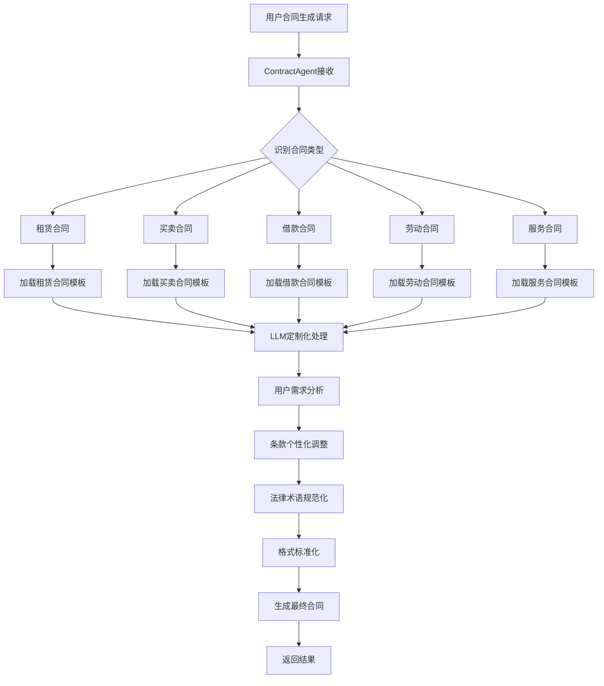

#### 智能合同定制流程
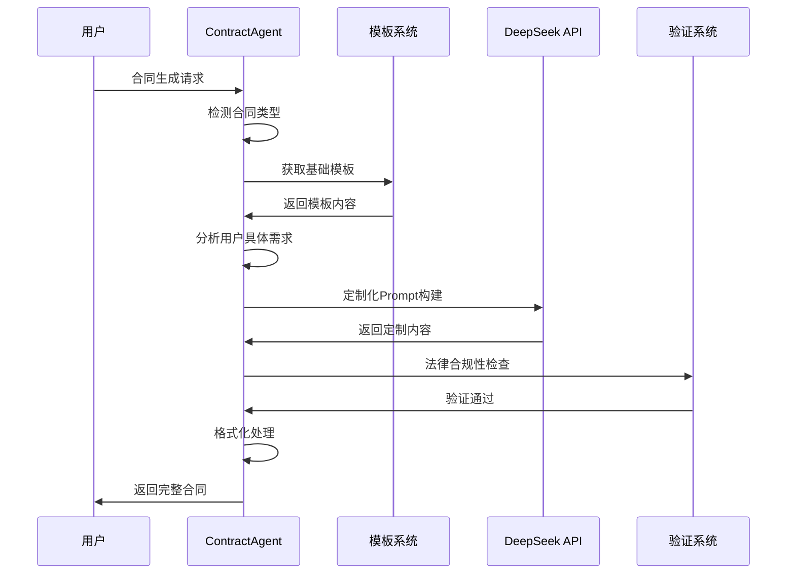

**支持合同类型**:
- 房屋租赁合同
- 买卖合同
- 借款合同
- 劳动合同
- 服务合同

**生成流程**:
1. 识别合同类型
2. 加载基础模板
3. 根据用户需求定制内容
4. 使用LLM优化表述
5. 返回规范化合同文本

**技术实现示例**:
```python
def _generate_smart_contract(self, question: str, contract_type: str, 
                           context_chats: list = None) -> dict:
    """使用大模型生成个性化合同"""
    try:
        # 获取基础模板
        base_template = self._get_contract_template(contract_type)
        
        # 使用大模型根据用户需求定制合同
        customized_contract = self._customize_contract_with_ai(
            base_template, question, contract_type, context_chats
        )
        
        return {
            "agent": "ContractAgent",
            "answer": f"已为您生成定制化的{contract_type}：\n\n{customized_contract}",
            "confidence": 0.95,
            "suggestions": [
                "请根据实际情况修改当事人信息",
                "如需调整条款，请告诉我具体要求",
                "建议法律专业人士审核后使用"
            ],
            "relevant_articles": ["《民法典》第三编 合同", "《民法典》第四百六十四条"],
            "query_type": "合同生成",
            "keywords": ["生成合同", contract_type],
            "contract_content": customized_contract,
            "type": "write"
        }
    except Exception as e:
        logger.error(f"合同生成失败: {e}")
        return self._get_fallback_contract_response(contract_type)

def _customize_contract_with_ai(self, base_template: str, question: str, 
                              contract_type: str, context_chats: list = None) -> str:
    """使用大模型定制合同内容"""
    system_msg = f"""你是一个专业的法律合同起草助手。请根据用户需求，对以下{contract_type}模板进行定制化修改：

基础模板：
{base_template}

要求：
1. 保持合同的法律有效性
2. 根据用户具体需求调整条款
3. 确保格式专业规范
4. 保留必要的法律条款
5. 使用规范的中文法律术语

请直接返回修改后的完整合同内容，不要添加额外说明。"""

    try:
        messages = [{"role": "system", "content": system_msg}]
        
        # 添加上下文对话记录
        if context_chats:
            for chat in context_chats:
                if chat.prompt and chat.answer:
                    messages.append({"role": "user", "content": chat.prompt})
                    messages.append({"role": "assistant", "content": chat.answer})
        
        # 添加当前问题
        messages.append({"role": "user", "content": f"请根据以下需求定制合同：{question}"})

        response = self._call_llm_api(messages)
        return response if response else base_template
    except Exception as e:
        logger.error(f"AI定制合同失败: {e}")
        return base_template
```

### 5.5 FAQAgent（常见问题处理器）

#### FAQ快速响应流程
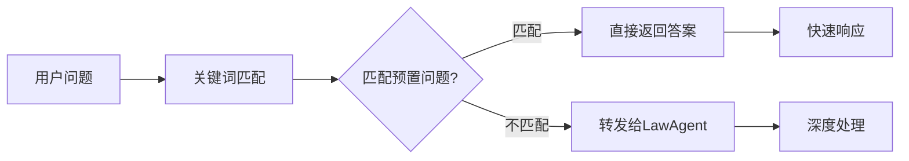

**预置问答库**:
- 合同纠纷处理
- 劳动权益保护
- 房产交易问题
- 婚姻家庭法律
- 公司法务咨询

**技术实现**:
```python
class FAQAgent:
    def __init__(self):
        self.FAQS = {
            "什么是合同": "合同是平等主体的自然人、法人、其他组织之间设立、变更、终止民事权利义务关系的协议...",
            "如何解除劳动合同": "根据《劳动合同法》规定，劳动合同的解除分为协商解除、法定解除等情况...",
            "房屋买卖注意事项": "房屋买卖应注意以下几点：1.核实房产证真实性 2.确认产权清晰 3.签订正式合同..."
        }
    
    def answer(self, question: str) -> dict:
        """快速问答处理"""
        for key, answer in self.FAQS.items():
            if key in question:
                return {
                    "agent": "FAQAgent",
                    "answer": answer,
                    "confidence": 0.9,
                    "query_type": "常见问题",
                    "source": "预置问答库"
                }
        
        # 未匹配到预置问题，返回引导信息
        return {
            "agent": "FAQAgent",
            "answer": "您的问题比较专业，建议详细描述具体情况以获得更准确的法律建议。",
            "confidence": 0.5,
            "suggestions": ["请提供更多具体信息", "可以咨询专业律师"]
        }
```

## 6. 数据库设计

### 6.1 表结构设计

#### 用户表 (user)
```sql
CREATE TABLE `user` (
  `user_id` int(11) NOT NULL AUTO_INCREMENT COMMENT '用户ID',
  `username` varchar(50) NOT NULL COMMENT '用户名',
  `password` varchar(255) NOT NULL COMMENT '密码',
  `email` varchar(100) NOT NULL COMMENT '邮箱',
  `create_time` datetime DEFAULT CURRENT_TIMESTAMP COMMENT '创建时间',
  PRIMARY KEY (`user_id`),
  UNIQUE KEY `username` (`username`),
  UNIQUE KEY `email` (`email`)
) ENGINE=InnoDB DEFAULT CHARSET=utf8mb4;
```

#### 历史记录表 (history)
```sql
CREATE TABLE `history` (
  `history_id` int(11) NOT NULL AUTO_INCREMENT COMMENT '主键id',
  `user_id` int(11) NOT NULL COMMENT '用户id',
  `title` varchar(100) DEFAULT NULL COMMENT '历史记录名称',
  `type` varchar(50) NOT NULL COMMENT '类型',
  `create_time` datetime DEFAULT CURRENT_TIMESTAMP COMMENT '创建时间',
  PRIMARY KEY (`history_id`),
  FOREIGN KEY (`user_id`) REFERENCES `user` (`user_id`) ON DELETE CASCADE
) ENGINE=InnoDB DEFAULT CHARSET=utf8mb4;
```

#### 对话记录表 (chat)
```sql
CREATE TABLE `chat` (
  `chat_id` int(11) NOT NULL AUTO_INCREMENT COMMENT '对话ID',
  `history_id` int(11) NOT NULL COMMENT '历史记录序号',
  `prompt` text COMMENT '问题',
  `answer` text COMMENT 'AI回答',
  `reference` text COMMENT '参考',
  `create_time` datetime DEFAULT CURRENT_TIMESTAMP COMMENT '创建时间',
  PRIMARY KEY (`chat_id`),
  FOREIGN KEY (`history_id`) REFERENCES `history` (`history_id`) ON DELETE CASCADE
) ENGINE=InnoDB DEFAULT CHARSET=utf8mb4;
```

#### 法律表 (laws)
```sql
CREATE TABLE `laws` (
  `law_id` int(11) NOT NULL AUTO_INCREMENT COMMENT '主键ID',
  `title` varchar(255) NOT NULL COMMENT '法律标题',
  `parts` json NOT NULL COMMENT '法律内容',
  `create_time` datetime DEFAULT CURRENT_TIMESTAMP COMMENT '创建日期',
  PRIMARY KEY (`law_id`),
  INDEX `idx_create_time` (`create_time`),
  INDEX `idx_title` (`title`)
) ENGINE=InnoDB DEFAULT CHARSET=utf8mb4;
```

### 6.2 数据访问层设计
采用DAO(Data Access Object)模式，每个数据表对应一个DAO类：
- **UserDAO**: 用户相关数据操作
- **HistoryDAO**: 历史记录数据操作  
- **ChatDAO**: 对话记录数据操作
- **LawDAO**: 法律数据操作

### 6.3 用户交互完整流程

### 用户注册登录流程
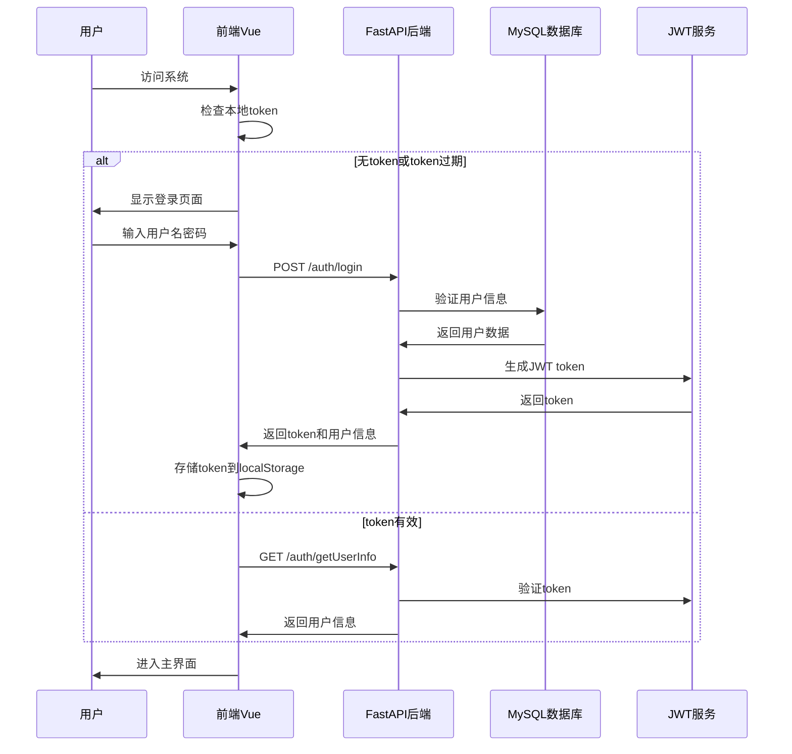

### 完整问答交互流程
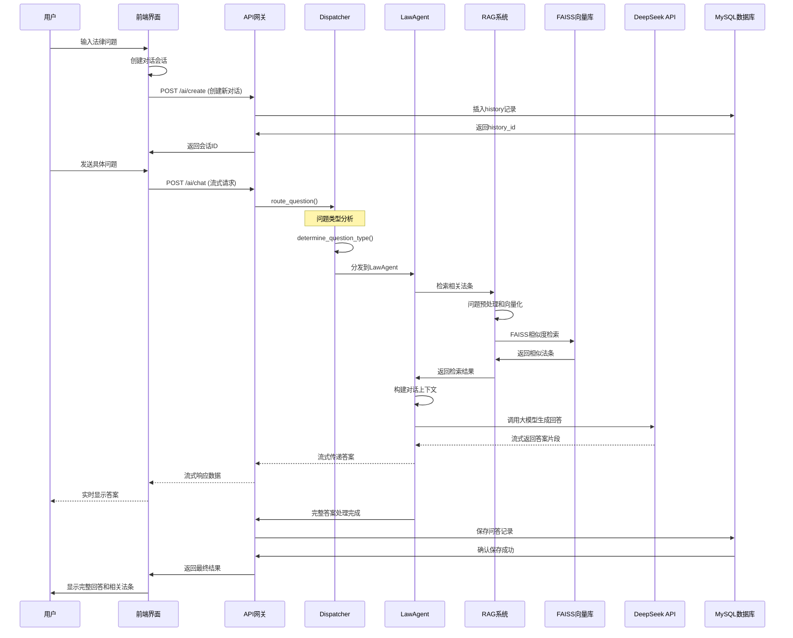

### 用户界面导航流程
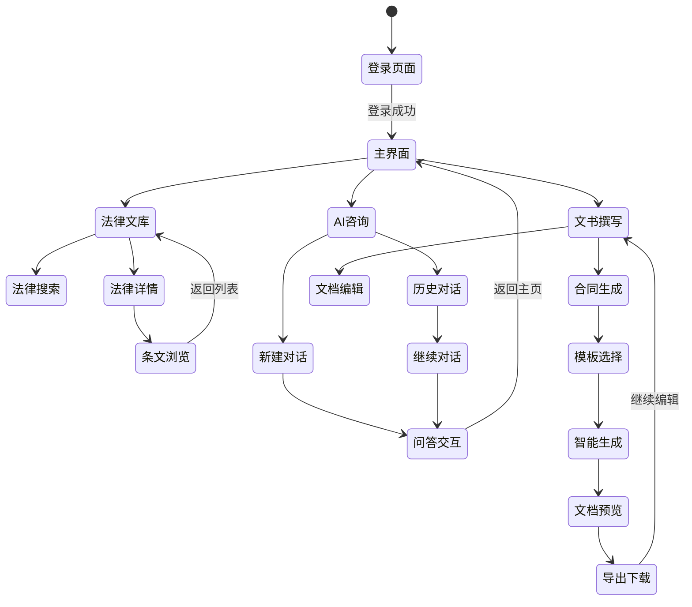

## 7. API接口设计

### 7.1 RESTful API设计原则
- 使用HTTP动词表示操作类型
- 使用资源名词作为URL路径
- 统一的响应格式
- 合适的HTTP状态码

### 7.2 主要API接口

#### 用户认证模块
```
POST /auth/register     # 用户注册
POST /auth/login        # 用户登录  
GET  /auth/getUserInfo  # 获取用户信息
```

#### AI问答模块
```
GET    /ai/getHistory      # 获取历史记录列表
GET    /ai/getChatInfo     # 获取对话详情
POST   /ai/create          # 创建新对话
PATCH  /ai/rename          # 重命名对话
DELETE /ai/delete          # 删除对话
POST   /ai/chat            # AI问答（流式响应）
```

#### 法律文库模块
```
POST /law/upload      # 上传法律文档
GET  /law/getAllLaws  # 获取法律列表
GET  /law/getLawInfo  # 获取法律详情
GET  /law/search      # 搜索法律条文
```

### 7.3 响应格式标准
```json
{
  "code": 0,           // 响应码，0表示成功
  "message": "操作成功", // 提示信息
  "data": {}           // 返回数据
}
```

## 8. 前端设计与实现

### 8.1 界面设计理念
- **简洁现代**: 采用扁平化设计，突出内容
- **响应式布局**: 适配桌面、平板、手机等多种设备
- **交互友好**: 流畅的动画和即时反馈
- **可访问性**: 支持键盘导航和屏幕阅读器

### 8.2 核心页面功能

#### 登录页面 (Login.vue)
- 粒子动画背景效果
- 几何装饰元素
- 表单验证和错误提示
- 登录状态管理

#### 法律文库页面 (Library.vue)
- 分类卡片展示
- 搜索和筛选功能
- 法律条文结构化展示
- 文档上传功能

#### AI咨询页面 (ChatPage.vue)
- 聊天界面设计
- 历史记录侧边栏
- 流式消息显示
- Markdown内容渲染

#### 文书撰写页面 (DocWriter.vue)
- 合同模板选择
- 实时编辑预览
- 导出和打印功能
- 格式化文档显示

### 8.3 状态管理
使用Pinia进行状态管理：
- **user.js**: 用户信息状态
- **token.js**: 认证令牌管理
- **chatId.js**: 对话会话状态

### 8.4 样式系统
```scss
// 全局变量定义
:root {
  --primary: #4a86e8;
  --secondary: #2c5aa0;
  --accent: #4a86e8;
  --dark: #1a1a1a;
  --gray: #e5e5e5;
}

// 组件化样式
.card {
  background: white;
  border-radius: 12px;
  box-shadow: var(--shadow);
  transition: all 0.3s ease;
}
```

## 9. 性能优化策略

### 9.1 前端性能优化
- **代码分割**: 路由级别的懒加载
- **资源压缩**: Vite自动压缩JS/CSS
- **图片优化**: 使用现代图片格式
- **缓存策略**: HTTP缓存和浏览器缓存

### 9.2 后端性能优化
- **数据库连接池**: 复用数据库连接
- **异步处理**: FastAPI异步特性
- **流式响应**: AI问答流式输出
- **索引优化**: 数据库查询索引

### 9.3 AI模型优化
- **向量缓存**: 缓存常用问题的向量
- **检索优化**: FAISS索引参数调优
- **模型选择**: 平衡性能和效果的模型选择
- **批处理**: 批量处理向量化请求

## 10. 安全性设计

### 10.1 认证与授权
- **JWT令牌**: 无状态认证机制
- **密码加密**: bcrypt哈希加密
- **令牌过期**: 自动过期和刷新机制
- **权限控制**: 基于角色的访问控制

### 10.2 数据安全
- **SQL注入防护**: 参数化查询
- **XSS防护**: 输入输出过滤
- **CSRF防护**: CSRF令牌验证
- **数据传输**: HTTPS加密传输

### 10.3 API安全
- **请求限制**: 频率限制和防爆破
- **输入验证**: Pydantic数据验证
- **错误处理**: 安全的错误信息返回
- **日志审计**: 操作日志记录

## 11. 部署与运维

### 11.1 部署架构
```
┌─────────────┐    ┌─────────────┐    ┌─────────────┐
│   Nginx     │    │  Uvicorn    │    │   MySQL     │
│  (反向代理)  │◄───┤ (FastAPI)   │◄───┤  (数据库)   │
│   静态文件   │    │   Python    │    │             │
└─────────────┘    └─────────────┘    └─────────────┘
                           │
                           ▼
                   ┌─────────────┐
                   │    FAISS    │
                   │  (向量数据库) │
                   └─────────────┘
```

### 11.2 环境配置
#### 开发环境
```bash
# 前端开发服务器
npm run dev          # 启动Vite开发服务器
# 后端开发服务器  
uvicorn main:app --reload  # 启动FastAPI开发服务器
```

#### 生产环境
```bash
# 前端构建
npm run build
# 后端部署
uvicorn main:app --host 0.0.0.0 --port 8000 --workers 4
```

### 11.3 监控与日志
- **应用监控**: 响应时间、错误率、并发数
- **系统监控**: CPU、内存、磁盘使用率
- **业务监控**: 用户活跃度、功能使用统计
- **日志管理**: 结构化日志和日志轮转

## 12. 测试策略

### 12.1 单元测试
- **后端测试**: pytest框架测试API接口
- **前端测试**: Vitest框架测试组件逻辑
- **数据库测试**: 数据访问层功能测试
- **AI模型测试**: RAG检索准确性测试

### 12.2 集成测试
- **API集成测试**: 端到端API调用测试
- **数据库集成测试**: 数据一致性测试
- **第三方服务测试**: DeepSeek API集成测试

### 12.3 性能测试
- **压力测试**: 并发用户访问测试
- **负载测试**: 系统承载能力测试
- **稳定性测试**: 长时间运行稳定性测试

## 13. 项目成果与指标

### 13.1 功能实现情况
- ✅ 用户注册登录系统
- ✅ AI法律问答功能
- ✅ 合同文书生成功能
- ✅ 法律文库管理
- ✅ 对话历史记录
- ✅ 响应式前端界面
- ✅ RESTful API接口
- ✅ RAG检索增强系统

### 13.2 技术指标
- **数据规模**: 3000+法律条文，40+部法律法规
- **响应性能**: API平均响应时间 < 500ms
- **检索性能**: FAISS向量检索 < 100ms
- **并发支持**: 支持100+并发连接
- **内存占用**: 基础运行 ~200MB，加载RAG模块 ~500MB
- **用户体验**: 流畅的交互和美观的界面

### 13.3 创新点
1. **多Agent架构**: 智能路由不同类型的法律问题
2. **RAG检索增强**: 结合向量检索和生成模型
3. **流式响应**: 实时显示AI生成过程
4. **合同智能生成**: 基于模板和AI的合同定制
5. **响应式设计**: 适配多种设备的现代化界面

## 14. 遇到的挑战与解决方案

### 14.1 技术挑战

#### 挑战1: RAG检索准确性
**问题**: 初期检索结果相关性不高，影响回答质量
**解决方案**: 
- 优化文本预处理流程
- 调整向量模型参数
- 增加相似度阈值筛选
- 改进问题关键词提取

#### 挑战2: 大模型API稳定性
**问题**: DeepSeek API偶发超时和限流
**解决方案**:
- 实现重试机制和错误处理
- 添加请求队列和限流控制
- 提供降级方案和缓存机制

#### 挑战3: 前后端数据同步
**问题**: 复杂的状态管理和数据一致性
**解决方案**:
- 使用Pinia集中状态管理
- 实现乐观更新机制
- 添加数据校验和同步机制

### 14.2 业务挑战

#### 挑战1: 法律专业性要求
**问题**: 确保生成内容的法律准确性
**解决方案**:
- 建立专业的法条数据库
- 增加置信度评估机制
- 提供专业免责声明

#### 挑战2: 用户体验优化
**问题**: 平衡功能复杂性和易用性
**解决方案**:
- 简化用户界面设计
- 提供引导和帮助信息
- 优化交互流程

## 15. 未来发展方向

### 15.1 功能扩展
- **多模态支持**: 支持图片、音频等多媒体输入
- **案例分析**: 增加法律案例检索和分析功能
- **智能推荐**: 基于用户行为的个性化推荐
- **协作功能**: 支持多用户协作编辑文档

### 15.2 技术升级
- **模型优化**: 使用更先进的大语言模型
- **检索增强**: 改进RAG检索算法和向量数据库
- **微服务架构**: 拆分为微服务提高可扩展性

### 15.3 业务拓展
- **移动端应用**: 开发iOS和Android应用
- **企业版本**: 针对法律事务所的专业版本
- **API服务**: 提供第三方集成API服务
- **国际化**: 支持多语言和国际法律体系

## 16. 总结

Law_LLM项目成功地将现代AI技术与法律服务相结合，构建了一个功能完整、技术先进的智能法律助手系统。项目在技术架构、功能实现、用户体验等方面都达到了预期目标，为法律服务的数字化转型提供了有价值的探索和实践。

### 16.1 项目价值
1. **技术价值**: 展示了RAG、多Agent架构在垂直领域的应用
2. **业务价值**: 提供了可行的法律服务数字化解决方案
3. **社会价值**: 降低了法律服务的门槛，提高了法律知识的普及度

### 16.2 经验总结
1. **架构设计**: 良好的系统架构是项目成功的基础
2. **技术选型**: 合适的技术栈能够提高开发效率
3. **用户体验**: 专业功能需要配合友好的用户界面
4. **持续优化**: 基于用户反馈的持续改进是必要的

