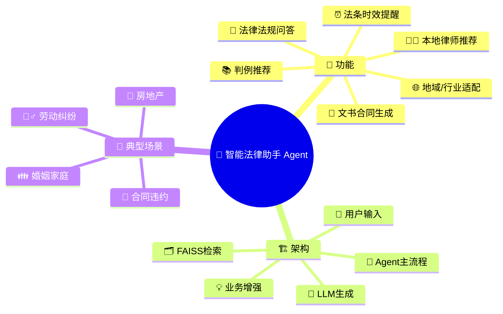

# Agent架构
---

1. 📝 **用户问题**  
   用户通过命令行或界面输入自己的法律问题。

2. 🔍 **模糊检查（Clarity Check）**  
   系统首先判断问题是否表达清晰，必要时会引导用户补充信息。

3. 🧠 **历史对话记忆（Conversation Memory）**  
   调用对话记忆，结合上下文理解用户意图，支持多轮连续咨询。

4. 🗂️ **问题类型分类与分发（Dispatcher）**  
   系统自动识别问题类型（如法律咨询、合同生成、判例查询等），并分派到对应的处理流程。

5. 📚 **知识检索（FAISS / Internet）**  
   针对具体问题，调用本地法律知识库或外部互联网进行智能检索，获取相关法条/知识。

6. 🤖 **初步答案生成（DeepSeek LLM）**  
   基于检索结果和用户问题，由大语言模型生成严谨的法律答复或文书草稿。

7. ✅ **自我反馈评估（Self-Feedback）**  
   系统自查答案的完整性和准确性，必要时自动补充或提醒用户。

8. 💬 **输出最终答案（Response）**  
   以结构化形式将答案、建议、相关法条/案例、推荐律师等输出给用户。

9. 📝 **日志记录（Logging）**  
   自动保存每一次问答、用户上下文及处理结果，便于后续追溯和数据分析。


---


# 智能法律助手 Agent 核心功能

1. 🤖 **法律法规检索与智能问答**  
   - 基于本地知识库和大模型，准确回答各类法律问题，提供权威法条和解析。

2. 📄 **文书/合同自动生成**  
   - 一键生成各类法律文书草稿，如合同、起诉状、授权书等，规范专业。

3. 📚 **判例（案例法）推荐**  
   - 智能检索并推荐真实案例，辅助理解法律适用和裁判趋势。

4. 🧑‍💼 **本地律师与专业机构推荐**  
   - 根据地域和专业领域，智能推荐优质本地律师及律所资源。

5. ⏰ **法规时效性检测与提示**  
   - 自动识别已废止或被新法替代的法条，及时提示用户避免引用失效法规。

6. 🌐 **地域/行业法规适配**  
   - 针对地区、行业等特定场景，优先输出适用法规和政策。

7. 📊 **置信度评估与辅助建议**  
   - 动态评估回答可信度，并给出专业建议与后续行动指引。

8. 💬 **上下文对话与多轮追问支持**  
   - 支持连续追问与多轮上下文记忆，保证交互自然流畅、信息完整。


---

## 模块设计说明

### 1. 法律知识库管理

- **FAISS向量检索**：支持本地海量法律条文/法规的语义化检索。
- **索引自动检测/构建**：系统首次运行自动检测索引文件，无则自动构建。
- **可扩展：** 支持案例库、行业法规库等自定义扩充。

### 2. LLM模型集成

- **DeepSeek大模型API对接**：统一由`OpenAI`类封装，对接`deepseek-chat`等主流大模型。
- **多角色交互**：支持系统消息、用户消息等多轮对话。

### 3. 智能法律问答

- **多类型问题自动分析**：如定义咨询、可行性咨询、程序咨询等。
- **关键词自动提取**：精准定位核心法律术语，增强检索效果。
- **置信度评估**：根据相似度自动量化答案可信度。

### 4. 法律文书合同生成

- **文书类型自动识别**：合同、协议、起诉状等自动触发文书生成。
- **大模型自适应生成草稿**：自动补充法律条款、格式规范，如缺关键信息自动提醒用户补充。
- **支持多场景扩展**：如委托书、承诺书等类型。

### 5. 判例推荐

- **常见法律问题自动关联判例库**，输出真实案件摘要，提升实用性和说服力。

### 6. 地域/行业法规适配

- **地域/行业自动识别**：如问题中含“北京”、“医疗”等，自动优先本地法规和行业规范。
- **可配置自定义列表**，支持多行业多区域扩展。

### 7. 本地律师推荐

- **多条件智能推荐**：地域+专业方向优先，退而求其次逻辑，确保用户获得最相关律师/机构信息。
- **可扩展为API、外部库对接**。

### 8. 法条时效性检测

- **自动判别法规有效性**：如法规已失效或被新法替代，自动高亮提示，避免误用废止条文。

### 9. 置信度与建议生成

- **根据检索相似度分级推荐建议**，如“高度相关建议直接引用”，“一般相关建议咨询律师”等。
- **特定问题类型提供个性化建议**，如程序型问题引导用户咨询相关部门。

---

## 典型工作流程图

**（Markdown流程图示意，推荐用Mermaid可视化工具画出更美观版本）**

```mermaid
flowchart TD
    U[用户输入问题] --> F1{是否法律文书/合同需求?}
    F1 -- 是 --> G1[调用大模型生成文书草稿]
    F1 -- 否 --> F2[分析问题类型/关键词]
    F2 --> S1[知识库检索]
    S1 --> F3[地域/行业适配]
    F3 --> F4[时效性检测]
    F4 --> G2[大模型生成法律问答]
    G2 --> F5[判例推荐]
    F5 --> F6[本地律师推荐]
    F6 --> O[输出答案+建议+案例+律师信息]


