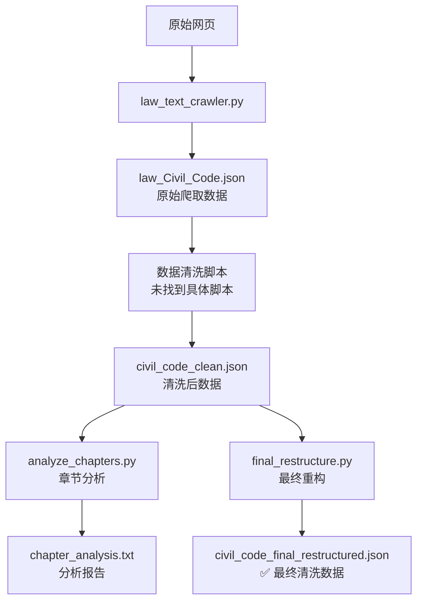

# 🏛️ 民法典数据爬取与清洗流程

## 📊 完整流程概览



## 🚀 操作步骤

### 1️⃣ 爬取原始数据
```bash
python law_text_crawler.py
```
**输出文件**：`law_Civil_Code.json`（原始网页数据）

### 2️⃣ 数据清洗（步骤缺失）
⚠️ **注意**：从 `law_Civil_Code.json` 到 `civil_code_clean.json` 的清洗脚本未找到
- 您需要创建或找到这个清洗脚本
- 该步骤应该：
  - 解析原始文本数据
  - 提取章节和条文
  - 结构化为JSON格式

### 3️⃣ 章节分析（可选）
```bash
python analyze_chapters.py
```
**输出文件**：`chapter_analysis.txt`（58章详细分析）

### 4️⃣ 最终重构
```bash
python final_restructure.py
```
**输出文件**：`civil_code_final_restructured.json` ✅

## 📁 最终清洗数据文件

**文件位置**：`civil_code_final_restructured.json`

**数据结构**：
```json
{
  "title": "中华人民共和国民法典",
  "note": "说明信息",
  "parts": [
    {
      "part_title": "第一编　总则",
      "chapters": [
        {
          "chapter_title": "第一章　基本规定",
          "articles": [
            {
              "article_no": "第一条",
              "article_content": "条文内容..."
            }
          ]
        }
      ]
    }
  ]
}
```

## 📈 数据统计

| 编号 | 编名 | 章数 | 条数 | 状态 |
|------|------|------|------|------|
| 第一编 | 总则 | 8章 | 174条 | ✅ 有内容 |
| 第二编 | 物权 | 16章 | 185条 | ✅ 有内容 |
| 第三编 | 合同 | 34章 | 458条 | ✅ 有内容 |
| 第四编 | 人格权 | 6章 | 0条 | 🏗️ 结构框架 |
| 第五编 | 婚姻家庭 | 5章 | 0条 | 🏗️ 结构框架 |
| 第六编 | 继承 | 4章 | 0条 | 🏗️ 结构框架 |
| 第七编 | 侵权责任 | 10章 | 0条 | 🏗️ 结构框架 |

**总计**：7编，83章，817条

## 🎯 如何获取最终清洗数据

### 方法1：直接使用现有文件
```bash
# 最终清洗好的数据文件已存在
文件位置：e:\WorkBench\VSCode\Law_LLM\Law_LLM\crawled data\civil_code_final_restructured.json
```

### 方法2：重新生成
```bash
# 切换到数据目录
cd "e:\WorkBench\VSCode\Law_LLM\Law_LLM\crawled data"

# 运行最终重构脚本
python final_restructure.py
```

## ⚠️ 注意事项

1. **数据完整性**：目前只有前3编（总则、物权、合同）有实际条文内容
2. **缺失脚本**：从原始数据到清洗数据的中间步骤脚本未找到
3. **数据来源**：数据来自北大法宝网站的民法典页面
4. **编码格式**：所有JSON文件使用UTF-8编码

## 📝 下一步建议

1. **补全清洗脚本**：创建从 `law_Civil_Code.json` 到 `civil_code_clean.json` 的转换脚本
2. **数据验证**：检查条文内容的准确性和完整性
3. **格式优化**：根据具体使用需求调整JSON结构
4. **备份数据**：重要的清洗数据应该进行备份

---

📅 **更新时间**：2025年7月1日  
📊 **数据版本**：已处理817条有效条文
